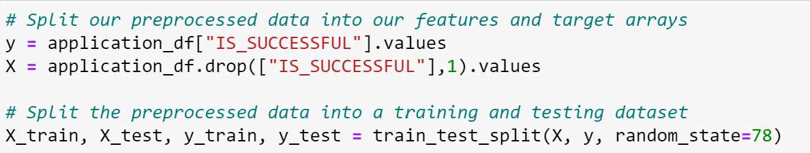
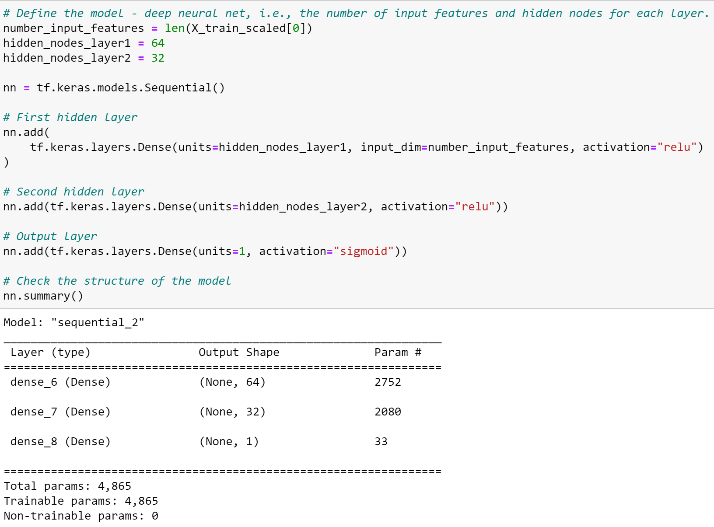

# Neural_Network_Charity_Analysis
Creating a binary classifier that is capable of predicting whether applicants will be successful if funded by Alphabet Soup.

# Overview of the analysis: 
Alphabet is a non-profit philanthropic foundation dedicated to helping organizations that protect the environment, improve people's well-being and unify the world. They have raised and donated over 10 billion dollars in the past 20 years. This money has been used to invest in lifesaving technologies and organize reforestation groups arouund the world.

This analysis is done for Bek who is incharge of data collection and analysis for the entire organization. She analyzes the impact of each donation and vet potential recipients. Hence using deep learning we have designed and trained a model to create a binary classifier that is capable of predicting whether applicants will be successful.

## Tools used :
We are using jupyter notebook to run our python code importing the pandas, sklearn and tensorflow libraries to run the keras model.

# Results: 

## Deliverable 1: Preprocessing Data for a Neural Network Model 
From Alphabet Soup’s business team, Beks received a CSV containing more than 34,000 organizations that have received funding from Alphabet Soup over the years. 

Using the knowledge of Pandas and the Scikit-Learn’s StandardScaler(), we've preprocessed the dataset in the following ways in order to compile, train, and evaluate the neural network model later in Deliverable.

The following preprocessing steps have been performed:
1. Dropping the identification columns : The EIN and NAME columns have been dropped.

2. The columns - "APPLICATION_TYPE" and "CLASSIFICATION" have more than 10 unique values and hence have been grouped together.
Although the column "ASK_AMT" is over 10 but as those are integers and information about the loan amount hence cannot be grouped.

As per the density graph, we have grouped all values below 550.

As per the density graph, we have grouped all values below 800.

3. The categorical variables have been encoded using one-hot encoding.

4. The preprocessed data is split into features and target arrays. The column "IS_SUCCESSFUL" has binary data and is our target('y') for this model.

5. The preprocessed data is split into training and testing datasets.

6. The numerical values have been standardized using the StandardScaler() module.

## 2. Deliverable 2: Compile, Train, and Evaluate the Model
We used the Tensor Flow Keras model.
The neural network model using Tensorflow Keras contains working code that performs the following steps:

1. The number of layers, the number of neurons per layer, and activation function are defined as per the code below :

As we have altogether 42 features, we are creating the model with 64 neurons using relu activations in layer 1 and 32 neurons using relu activation in layer 2.

An output layer with a sigmoid activation function is created

The  output for the structure of the model was fit by running 100 epochs

The target model was able to train the data with 74% accuracy and 53% loss.

The output of the model’s loss and accuracy using the test model is 72% accuracy and 56% loss.

The model's weights are saved every 5 epochs in the checkpoint folder as below :

The results are saved to an HDF5 file named AlphabetSoupCharity.h5

## Deliverable 3: Optimize the Model
The model is optimized, and we tried to increase the predictive accuracy to over 75%, making three attempts to increase model performance using the following steps:
1. Noisy variables are removed from features. We did not see any other variables that could be removed. Instead we looked at the value counts for 'AFFILIATION' column.

We decided to group the 'AAFILIATION' column for values below 35 resulting in the following:

### Attempt 1 :
In the first attempt, we tried to rerun the earlier model after binning the 'AFFILIATION' column and achieved 74% of accuracy.

### Attempt 2 - Changing the neurons
We changed the number of neurons in the second attempt and achieved an accuracy of 74%.

### Attempt 3 Changing the layers activation, adding one more layer and changing the number of epochs.
We changed the activation of the layers and also added one more additional layer alongwith increasing the number of epochs to 300 as shown in the images below:

The accuracy of Attempt 3 was %74.25 which so far the best accuracy percentage.

# Summary: Summarize the overall results of the deep learning model.

1. From the above models, we can summarize that the models were able to train best upto 74%.
Below is the summary of all Neural Network models :

2. As the data is limited, we tried other Supervised Learning models like Decision Trees and Random Forest Tree.
Below is the confusion matrix for the same :

The percentage achieved in the decision tree model was max 73%.

As per the above, the Random Forest model gave a recall score of 75%.

3. From the above models we can conclude that in order for the accuracy percentage to be better than 75%, we need more data to train the models.

